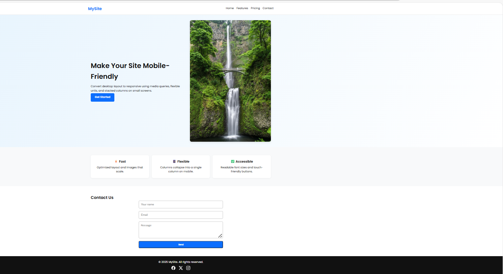
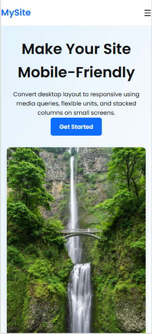
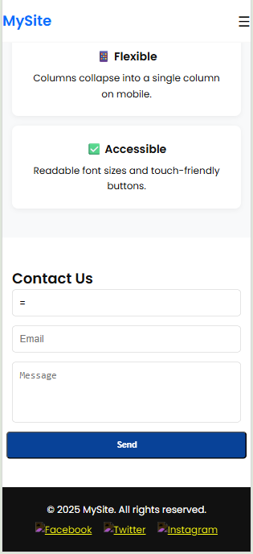

# 🌐 Responsive Website – Task 4

This project is **Task 4** of the Web Development Internship.  
It is a **responsive website** built using **HTML5, CSS3, and JavaScript** based on the given PDF requirements.

---

## 📌 Features

- **Hero Section** with an attractive background image (`hero-image.png`).
- **Features Section** with three feature cards.
- **Pricing Section** with responsive pricing cards.
- **Contact Form** with built-in HTML5 validation.
- **Footer** with clickable social media links (Facebook, Twitter/X, Instagram).
- Fully **Responsive** for desktop, tablet, and mobile (≤768px).

---

## 🗂 Project Structure


---

## 🛠 Technologies Used

- **HTML5** – Semantic structure
- **CSS3** – Styling & responsive layout (Flexbox)
- **JavaScript** – Form validation & interactivity

---

## 📷 Screenshots

### 💻 Desktop View


### 📱 Mobile View



> 💡 **Note:** Replace `desktop-view.png` and `mobile-view.png` with your actual screenshots before pushing to GitHub.

---

## 🚀 How to Run the Project Locally

1. **Clone this repository**  
   ```bash
   git clone https://github.com/leeyangithubrit/Task-4-Mobile-EL.git
   cd task-4
